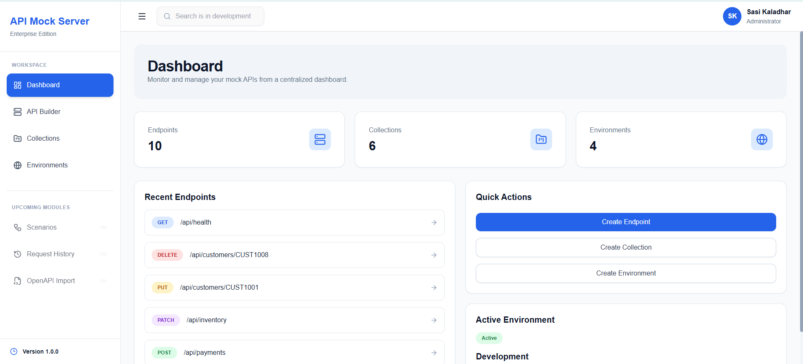
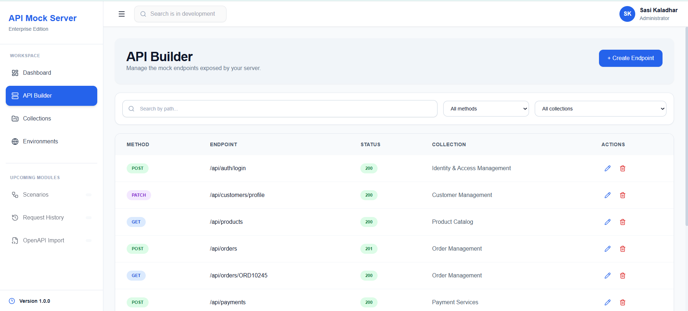
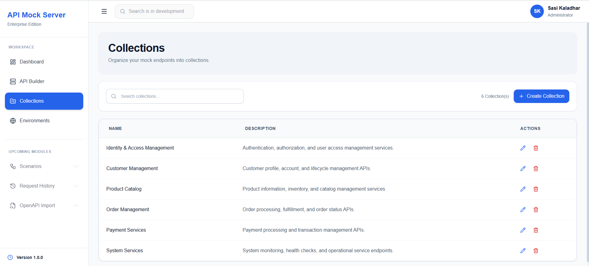
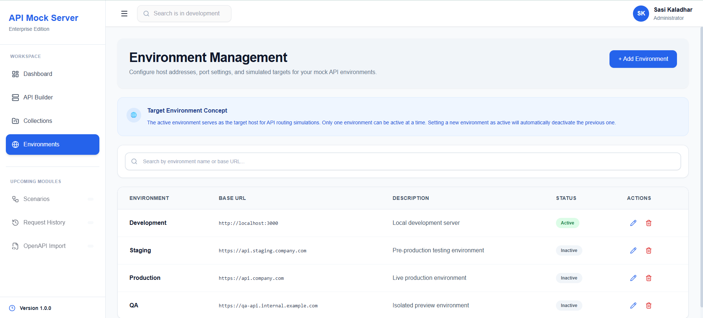

# API Mock Server & Scenario Simulator — Frontend

A React-based developer interface for configuring, organizing, and managing mock REST APIs.

The frontend provides an intuitive user experience for creating mock endpoints, organizing them into collections, managing environments, and interacting with the backend mock server. It is designed for frontend developers and QA engineers who need a visual interface to define and manage mock APIs during application development and testing.

---

# Overview

The **API Mock Server & Scenario Simulator** is a full-stack developer tool that enables teams to continue frontend development and API testing without waiting for backend services.

This frontend application communicates with an ASP.NET Core Web API backend and provides a clean, responsive interface for managing mock API configurations stored in MongoDB.

As the project evolves, the application will support advanced mock scenarios such as configurable delays, timeout simulation, request logging, OpenAPI import, response templating, and environment switching.

---

# Features

## Currently Available

### Dashboard

- View project statistics
- Quick access to major modules
- Summary cards
- Recent endpoint overview

### API Builder

- Create mock endpoints
- Edit endpoint configuration
- Delete endpoints
- Search endpoints
- Filter endpoints by HTTP method

### Collections Management

- Create collections
- Update collections
- Delete collections
- Organize mock endpoints

### Environment Management

- Create environments
- Edit environments
- Delete environments
- Activate environments

### User Experience

- Responsive layout
- Sidebar navigation
- Top navigation bar
- Search functionality
- Reusable UI components
- Modern enterprise-style interface

---

## Planned Features

The frontend is designed to support additional capabilities including:

- Request History
- Response Preview
- OpenAPI Import
- Environment Switching
- Advanced Form Validation
- Toast Notifications
- Response Templates
- Advanced Search & Filtering
- Enhanced Developer Experience

---

# Technology Stack

## Frontend

- React (Create React App)
- React Router
- Axios
- Tailwind CSS

## Development Tools

- Git
- GitHub
- Visual Studio Code

---

# System Architecture

The frontend is part of a layered architecture consisting of a React presentation layer, an ASP.NET Core backend, and MongoDB.


Additional technical diagrams are available in the `docs` directory.

---

# Project Structure

```text
api-mock-server-frontend
│
├── public
│
├── src
│   ├── assets
│   ├── components
│   │   ├── common
│   │   ├── layout
│   │   └── ui
│   │
│   ├── hooks
│   ├── layouts
│   ├── pages
│   │   ├── Dashboard
│   │   ├── ApiBuilder
│   │   ├── Collections
│   │   └── Environments
│   │
│   ├── services
│   ├── styles
│   ├── utils
│   ├── App.js
│   └── index.js
│
├── docs
├── package.json
└── README.md
```

---

# Installation

## Clone Repository

```bash
git clone <frontend-repository-url>
```

## Install Dependencies

```bash
npm install
```

## Start Development Server

```bash
npm start
```

Application URL

```
http://localhost:3000
```

> Ensure the backend API is running before using the application.

---

# Backend Integration

The frontend communicates with the ASP.NET Core Web API using REST APIs over HTTP/JSON.

Current modules interact with backend APIs for:

| Module | Operations |
|---------|------------|
| Mock Endpoints | Create, Read, Update, Delete |
| Collections | Create, Read, Update, Delete |
| Environments | Create, Read, Update, Delete |

---

# Screenshots

## Dashboard



Displays project statistics, quick actions, and recently created endpoints.

---

## API Builder



Create, edit, search, and manage mock endpoints.

---

## Collections



Organize mock endpoints into reusable collections.

---

## Environment Management



Manage application environments used by mock APIs.

---

# Documentation

The project documentation includes the following architecture and design diagrams.

| Document | Description |
|----------|-------------|
| `docs/01-system-architecture.png` | High-level system architecture |
| `docs/02-foundation-architecture.png` | Current implementation overview |
| `docs/03-api-request-lifecycle.png` | API request processing flow |
| `docs/04-database-design.png` | MongoDB collection design |
| `docs/05-frontend-component-architecture.png` | Frontend application architecture |
| `docs/06-backend-component-architecture.png` | Backend application architecture |

---

# Roadmap

The frontend will continue to evolve with additional developer-focused capabilities.

- [ ] Request History
- [ ] Response Preview
- [ ] OpenAPI Import
- [ ] Environment Switching
- [ ] Advanced Validation
- [ ] Enhanced Search & Filtering
- [ ] Improved User Experience
- [ ] Response Template Editor

---

# Contributing

Contributions are welcome.

Please create a feature branch, follow the existing project structure, and ensure changes are tested before submitting a pull request.

---

# Author

**Sasi Kaladhar**

Developer

API Mock Server & Scenario Simulator

---

# License

This project is intended for educational and internship purposes.
