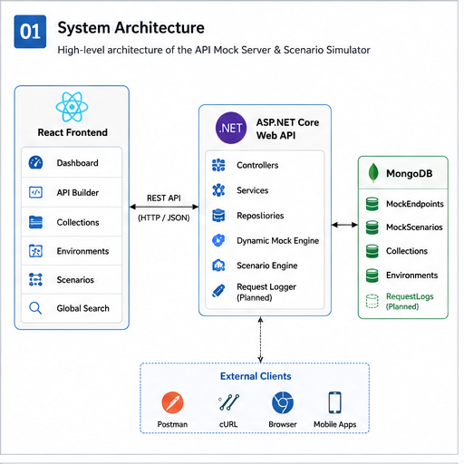
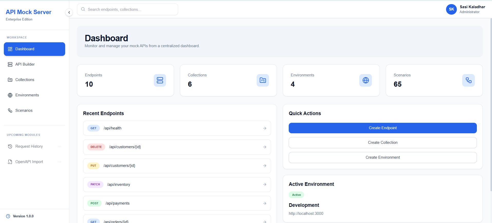
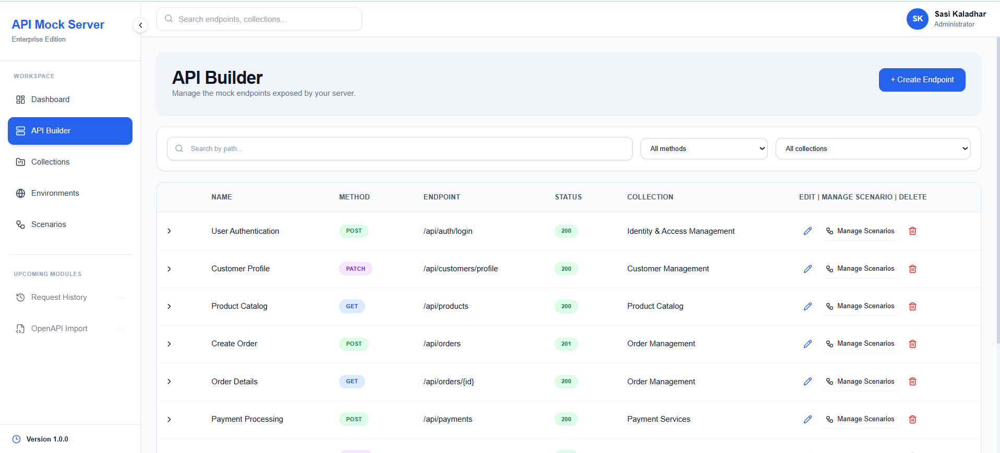
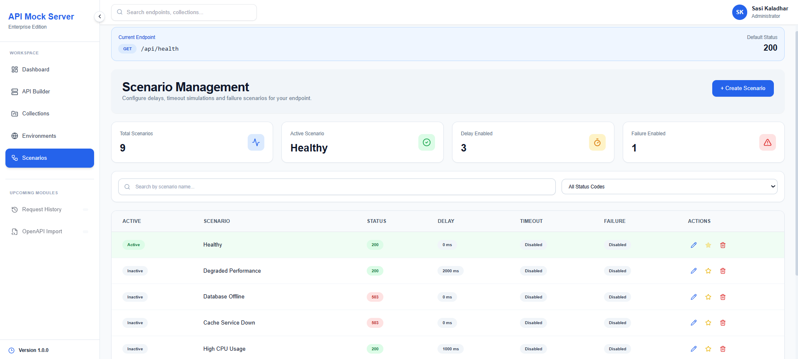
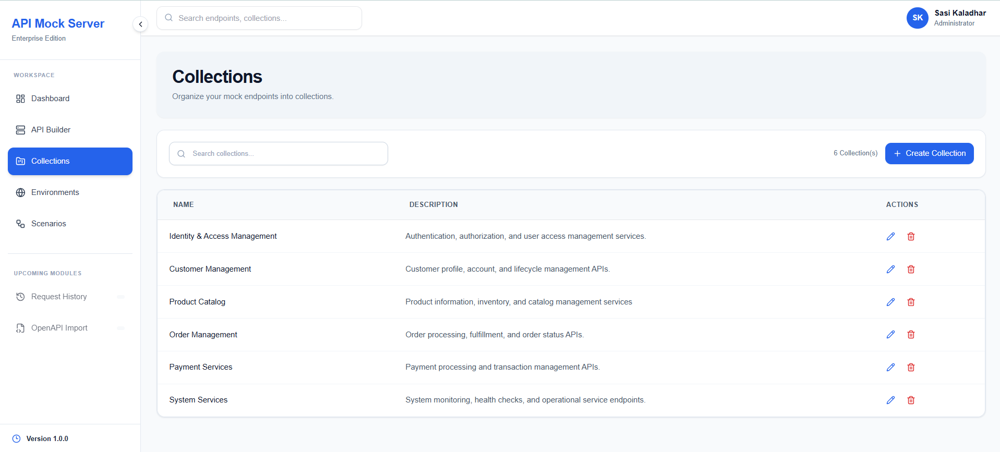
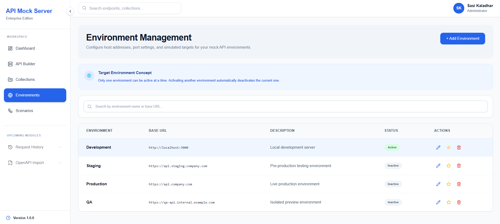
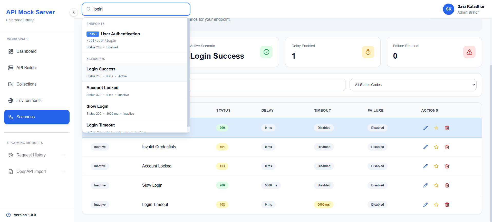

# API Mock Server & Scenario Simulator — Frontend

A modern React-based developer interface for designing, configuring, organizing, and testing configurable mock REST APIs.

The frontend provides an intuitive enterprise-style dashboard for managing mock endpoints, scenarios, collections, and environments while interacting with the ASP.NET Core backend. It enables frontend developers and QA engineers to simulate backend behavior without depending on live services.

---

# Overview

The **API Mock Server & Scenario Simulator** is a full-stack developer tool that allows teams to continue frontend development, integration, and API testing even when backend services are unavailable or under development.

This frontend application communicates with the ASP.NET Core Web API backend and provides an interactive interface for creating and managing mock APIs stored in MongoDB.

The application currently supports complete management of mock endpoints, collections, environments, and mock scenarios while offering dynamic search, enterprise dashboard navigation, and API simulation configuration.

---

# Features

## Currently Available

### Dashboard

- Interactive project dashboard
- Statistics cards
- Endpoint summary
- Collection summary
- Environment summary
- Scenario summary
- Quick navigation

---

### API Builder

- Create mock endpoints
- Update endpoint configuration
- Delete endpoints
- Search endpoints
- Filter by HTTP Method
- Enable / Disable endpoints
- Endpoint statistics

---

### Scenario Management

- Create scenarios
- Edit scenarios
- Delete scenarios
- Activate scenarios
- Configure custom responses
- Configure response status codes
- Configure response delays
- Configure timeout simulation
- Configure random failure simulation
- Search scenarios
- Filter by status code

---

### Collections

- Create collections
- Edit collections
- Delete collections
- Organize endpoints
- Search collections

---

### Environment Management

- Create environments
- Edit environments
- Delete environments
- Activate environments
- Search environments

---

### Global Search

- Search endpoints
- Search collections
- Search environments
- Search scenarios
- Instant search results
- Navigation to matched records
- Automatic row highlighting

---

### User Experience

- Modern enterprise dashboard
- Responsive layout
- Mobile-friendly interface
- Collapsible sidebar
- Professional navigation
- Reusable UI components
- Consistent design system
- Loading indicators
- Confirmation dialogs
- Empty state components

---

# Upcoming Features

- Request History
- Request Logs
- OpenAPI Import
- Response Preview
- Environment Switching
- Advanced Validation
- Toast Notifications
- Response Templates
- Advanced Filtering
- Export / Import Configuration

---

# Technology Stack

## Frontend

- React
- React Router
- Axios
- Tailwind CSS
- Lucide React

## Development Tools

- Visual Studio Code
- Git
- GitHub

---

# System Architecture

The frontend serves as the presentation layer of the API Mock Server & Scenario Simulator.

```
React Frontend
       │
REST API (HTTP/JSON)
       │
ASP.NET Core Web API
       │
MongoDB
```


Additional architecture diagrams are available inside the **docs** folder.

---

# Project Structure

```text
api-mock-server-ui
│
├── public
│
├── src
│   ├── api
│   ├── assets
│   ├── components
│   │   ├── forms
│   │   ├── layout
│   │   ├── search
│   │   └── ui
│   │
│   ├── hooks
│   ├── pages
│   │   ├── Dashboard
│   │   ├── ApiBuilder
│   │   ├── Collections
│   │   ├── Environments
│   │   └── Scenarios
│   │
│   ├── services
│   ├── utils
│   ├── App.jsx
│   └── index.js
│
├── docs
├── package.json
└── README.md
```

---

# Installation

## Clone Repository

```bash
git clone <frontend-repository-url>
```

## Install Dependencies

```bash
npm install
```

## Start Development Server

```bash
npm start
```

Frontend URL

```
http://localhost:3000
```

> Ensure the backend application is running before using the frontend.

---

# Backend Integration

The frontend communicates with the ASP.NET Core Web API using REST APIs.

| Module | Operations |
|----------|-------------------------|
| Mock Endpoints | CRUD |
| Mock Scenarios | CRUD + Activate |
| Collections | CRUD |
| Environments | CRUD |
| Dynamic Mock Execution | Execute Mock APIs |

---

# Screenshots

## Dashboard



Provides an overview of the project with statistics for endpoints, collections, environments, and scenarios, enabling developers to quickly understand the current mock server configuration.

---

## API Builder



Create, edit, delete, search, filter, and manage mock API endpoints from a centralized interface.

---

## Scenario Management



Configure dynamic API behavior by creating multiple scenarios for an endpoint, including custom responses, status codes, delays, timeout simulation, and random failure simulation.

---

## Collections



Group related mock endpoints into reusable collections for better organization and management.

---

## Environment Management



Create and manage multiple environments used during API simulation and testing.

---

## Global Search



Search across endpoints, scenarios, collections, and environments with instant navigation to matching records.

---

# Documentation

The repository includes architecture diagrams and design documentation.

| Document | Description |
|----------|-------------|
| `docs/01-system-architecture.png` | High-level project architecture |
| `docs/02-foundation-architecture.png` | Foundation layer architecture |
| `docs/03-api-request-lifecycle.png` | Request execution lifecycle |
| `docs/04-database-design.png` | MongoDB database design |
| `docs/05-frontend-component-architecture.png` | Frontend component architecture |
| `docs/06-backend-component-architecture.png` | Backend component architecture |

---

# Roadmap

## Completed

- ✅ Dashboard
- ✅ API Builder
- ✅ Mock Endpoint CRUD
- ✅ Mock Scenario CRUD
- ✅ Collection CRUD
- ✅ Environment CRUD
- ✅ Dynamic Search
- ✅ Enterprise Dashboard Layout
- ✅ Responsive User Interface
- ✅ Dynamic Mock Engine Integration

---

## Planned

- [ ] Request History
- [ ] Request Log Viewer
- [ ] Response Preview
- [ ] OpenAPI Import
- [ ] Environment Switching
- [ ] Advanced Validation
- [ ] Toast Notifications
- [ ] Response Templates
- [ ] Export / Import Configuration
- [ ] Advanced Filtering
- [ ] Dark Mode

---

# Contributing

Contributions are welcome.

To contribute:

1. Fork the repository.
2. Create a feature branch.
3. Follow the existing project structure and coding standards.
4. Test your changes before submitting.
5. Open a Pull Request describing your changes.

---

# Future Enhancements

The frontend has been designed with extensibility in mind and will continue to evolve with additional enterprise-level capabilities, including:

- Request Analytics Dashboard
- API Performance Metrics
- Environment Comparison
- Collection Import & Export
- Team Collaboration Features
- User Authentication & Authorization
- Role-Based Access Control
- Theme Customization
- Keyboard Shortcuts
- API Documentation Viewer

---

# Author

**Sasi Kaladhar**

Developer

**API Mock Server & Scenario Simulator**

Built as a full-stack developer tool using React, ASP.NET Core Web API, and MongoDB to simplify API development, frontend integration, and testing through configurable mock services.

---